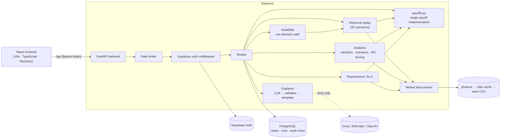

<div align="center">

# Neural Nexus

### Suitability-aware payoff simulator for structured products

Configure an Equity-Linked Note, Capital-Protected Note or Dual Currency Deposit, replay it on real market history,
check it against a client's profile with deterministic rules, and get a plain-language explanation. All in one workflow.


</div>

> **Decision-support prototype. Not investment advice.** Analysis uses historical data and statistical models; past
> performance does not predict future results. Suitability must be confirmed by a qualified person.
> See [Limitations](#known-limitations-and-disclaimers).

---

## Table of contents

1. [What it does](#what-it-does)
2. [Products and payoff conventions](#products-and-payoff-conventions)
3. [Architecture](#architecture)
4. [How a decision is made](#how-a-decision-is-made)
5. [Quick start](#quick-start)
6. [Docker](#docker)
7. [Configuration](#configuration)
8. [API reference](#api-reference)
9. [Security and operations](#security-and-operations)
10. [Testing and CI](#testing-and-ci)
11. [Project structure](#project-structure)
12. [Known limitations and disclaimers](#known-limitations-and-disclaimers)
13. [Troubleshooting](#troubleshooting)

---

## What it does

Structured products are hard for relationship managers (RMs) to configure and harder for clients to understand. Neural Nexus
lets an RM:

| Step | Capability |
|---|---|
| **Configure** | Pick a product type, underlying, tenor, strike / barrier and coupon. Terms are validated against configurable bounds. |
| **Visualise** | Payoff at maturity, a scenario table (−30 % … +20 %), break-even, maximum loss / gain, indicative fair-value check. |
| **Replay history** | Replay the exact terms on **20 real past market periods** of the same length, plus rolling-window statistics (probability of loss, CVaR, histogram, crisis presets) and an optional block-bootstrap Monte Carlo. |
| **Check suitability** | Deterministic rules compare the product with the client's risk appetite, horizon, loss tolerance, concentration, complexity, life stage, affordability, liquidity and compliance gates. |
| **Explain** | A plain-language explanation for the client and a technical briefing for the RM, generated from computed facts only. |
| **Recommend & fix** | Rank a grid of candidate products for a client, or suggest term changes that resolve a mismatch. |
| **Audit** | Every complete analysis is appended to a SHA-256 hash chain. |

Surfaces:

| Route | Audience | Purpose |
|---|---|---|
| `/` | Anyone | Landing page |
| `/client`, `/client/profile` | Client | Questionnaire, recommendation and explanation in plain language |
| `/rm` | Relationship manager | Full configurator, replay, suitability assessment, recommendations |
| `/dashboard/:runId` | Both | Full analysis view of a saved run |
| `/login`, `/client/register`, `/rm/register` | Anyone | Sign-in and onboarding |

---

## Products and payoff conventions

There is **exactly one implementation of each payoff formula** (`backend/app/simulation/sim_engine/payoffs.py`). The replay,
scenario table, payoff curve, Monte Carlo, recommendations and the API adapters all call it.

| Product | What the investor receives at maturity |
|---|---|
| **ELN**: Equity-Linked Note (barrier / reverse-convertible style) | Principal plus coupon, unless the barrier was breached **and** the final level is below the strike. Then `principal × final / strike + coupon`. |
| **CPN**: Capital-Protected Note | `principal × (protection + min(participation × max(0, final − 1), cap))`. With no cap the upside is unlimited. |
| **DCD**: Dual Currency Deposit | Deposit plus interest. If the FX rate ends beyond the strike, repaid in the alternate currency at the strike, valued back in the deposit currency at the final rate. |

Conventions (identical everywhere):

- **Percentages are relative** to the start level: strike 100 % is the initial level, barrier 75 % is 75 % of it.
- **ELN barrier** is observed on **every daily close** by default (`barrier_monitoring: daily`); `maturity` compares only the final
  close. A close exactly on the barrier is *not* a breach. The strike defaults to 100 % of the start price.
- **ELN coupon** is paid regardless of the barrier unless `coupon_conditional` is set, in which case a breach forfeits it.
- **DCD interest** accrues by contractual calendar days ÷ 365 from the trade date. The strike is re-struck at the same offset from
  spot in every historical window, so history is not compared against today's absolute level.
- **Notional scales money, not returns.** Changing the notional never changes the percentage outcome.

---

## Architecture



**Design rules**

- **One source of truth for each concern.** One set of payoff formulas, one set of historical windows, one price source, one
  suitability decision path and one explainer. `/api/analyze` and `/api/assess` return identical checks for the same client and
  product (pinned by `tests/test_unified_engine.py`).
- **Deterministic first, LLM last.** Payoffs, replay results and suitability are computed in code. The LLM only narrates facts.
- **Config-driven.** Product bounds, stress shocks, rates, issuer credit, suitability thresholds and the underlying whitelist
  live in YAML, not in code.
- **Offline-capable.** Prices fall back live → disk cache (12 h) → bundled seed CSVs, and every response states which source
  was used and the `as_of` date.

---

## How a decision is made

```
configure product ─► validate terms ─► fetch prices (one source)
        ─► payoff curve · scenarios · rolling-window statistics · Monte Carlo
        ─► 20-scenario historical replay
        ─► suitability assessment ─► explanation ─► audit record
```

### Suitability engine

Every verdict is produced by `backend/app/assessment/unified.py`:

| Layer | Checks | Effect on verdict |
|---|---|---|
| **Core rules** (`rules_engine.py`) | Risk appetite (structure **and** worst historical period), investment horizon, loss tolerance (worst historical loss vs. tolerance), concentration vs. liquid net worth | Decisive |
| **Compliance gates** | AML level, FATCA, vulnerable client, stale profile. *No screening on file ⇒ REVIEW, never silently clean.* | Decisive |
| **Profile checks** (`extra_checks.py`) | Product complexity vs. experience, life stage, affordability, liquidity needs | Decisive |
| **Notes** | Currency risk, indicative-pricing sanity, KYC data completeness | Informational only |

Outcome: any `FAIL` → **NOT_SUITABLE**, any `REVIEW` → **REVIEW_REQUIRED** (shown as *conditionally suitable* in the analysis
views), otherwise **SUITABLE**. A high coupon never offsets a failed check, and capital protection is never described as risk-free:
issuer credit risk is shown as an explicit figure.

### Explanations

`backend/app/explain/engine.py` serves both `/api/analyze` and `/api/assess`. For each audience (client and RM) it:

1. builds structured **facts** from the deterministic results (no client name or free text is ever included);
2. asks the configured LLM for a JSON explanation, if one is configured;
3. **validates** it: verdict wording, failed checks stated as failures, no banned phrases (“guaranteed”, “risk-free” …),
   no compliance detail in client text, CPN text mentions issuer dependence, and **every number must exist in the facts**;
4. otherwise falls back to a deterministic **template** (so the app works fully offline with `LLM_PROVIDER=none`).

Clients receive a **redacted view**: no compliance-screening results, no KYC-completeness notes and no RM briefing.

---

## Quick start

**Prerequisites:** Python 3.11+ (tested on 3.13), Node 20+ (tested on 22), a PostgreSQL database and a Supabase project
(local via the [Supabase CLI](https://supabase.com/docs/guides/cli), or hosted).

### 1. Backend

```bash
cd backend
pip install -r requirements-dev.txt
cp ../.env.example .env            # then fill in DATABASE_URL and the SUPABASE_* values
uvicorn app.main:app --reload --port 8000
```

### 2. Frontend

```bash
cd frontend
cp .env.example .env.local         # VITE_SUPABASE_URL / VITE_SUPABASE_ANON_KEY
npm install
npm run dev                        # http://localhost:5173 (proxies /api to :8000)
```

### 3. Supabase and demo data

1. Apply `supabase/migrations/20261003000000_create_user_profiles.sql` (`supabase db reset` locally, or `supabase link` + `supabase db push`).
2. Put the project URL and keys in `backend/.env` and `frontend/.env.local`. **The service-role key is server-only; never put it in a `VITE_` variable.**
3. Seed the fictitious dataset (clients, RMs, Supabase users, case records) from `backend/`:

   ```bash
   python scripts/seed_india_data.py
   ```

   The dataset files are no longer kept in the repository (they held demo credentials). Place your own
   `clients_india.json` and `relationship_managers_india.json` in the repository root before running it; skip this step if your
   database and Supabase project are already populated.

### 4. Market seed data (optional, needs internet once)

```bash
cd backend && python scripts/build_seed.py   # writes data/seed/*.csv so demos run offline
```

### Command-line tools

```bash
cd backend
python -m app.simulation.sim_engine run tests/sample_inputs/eln_100.json --index 0   # replay one product
python -m app.simulation.sim_engine check tests/sample_inputs/dcd_100.json          # validate a products file
python -m scripts.run_assessment_batch --sim path/to/simulation_output.json         # every client vs. one product
```

---

## Docker

```bash
cp .env.example backend/.env       # fill in
docker compose --env-file frontend/.env.local up --build
```

- App: <http://localhost:8080> (nginx serves the SPA and proxies `/api` to the backend).
- `backend/.env` provides runtime settings; `--env-file` supplies the public `VITE_SUPABASE_*` build arguments.
- **Always pass `--build` after pulling changes**: plain `docker compose up` reuses the previously built image.
- The compose file sets `TRUST_PROXY_HEADERS=true` so rate limiting sees real client IPs behind nginx. Leave it `false` when the
  API is exposed directly.
- The backend image runs as a non-root user and has a health check on `/health`.

---

## Configuration

### Environment variables (`backend/.env`; template in [`.env.example`](.env.example))

| Variable | Purpose | Default |
|---|---|---|
| `DATABASE_URL` | PostgreSQL connection string (cases, runs, audit, registration) | required for DB-backed routes |
| `SUPABASE_URL`, `SUPABASE_ANON_KEY` | Token validation against Supabase Auth | required |
| `SUPABASE_SERVICE_ROLE_KEY` | Account provisioning and demo seeding (**backend only**) | required for onboarding |
| `LLM_PROVIDER` | `groq` \| `anthropic` \| `openai` \| `none` | `none` |
| `GROQ_API_KEY` / `LLM_API_KEY`, `LLM_MODEL` | Provider key and model id (leave the model empty for the provider default) | empty |
| `CORS_ORIGINS` | Comma-separated allowed browser origins | `http://localhost:5173` |
| `RATE_LIMIT_ENABLED`, `RATE_LIMIT_SCALE` | Toggle rate limiting; multiply every limit | `true`, `1.0` |
| `TRUST_PROXY_HEADERS` | Read the client IP from `X-Forwarded-For` (only behind a trusted proxy) | `false` |
| `LOG_LEVEL` | `DEBUG` \| `INFO` \| `WARNING` \| `ERROR` | `INFO` |

Frontend (`frontend/.env.local`): `VITE_SUPABASE_URL`, `VITE_SUPABASE_ANON_KEY` (public by design).

### YAML configuration (`backend/config/`)

| File | Controls |
|---|---|
| `products.yaml` | Defaults, parameter bounds, recommendation grids, stress shocks, risk-free rates, issuer credit assumptions, replay / Monte Carlo settings, crisis presets |
| `underlyings.yaml` | The underlying whitelist: tickers, currency, asset class, illustrative dividend yield |
| `suitability_rules.yaml` | Profile-check thresholds, scoring weights, banned explanation phrases |
| `registration.yaml` | KYC / RM onboarding rules, client thresholds (age, allocation, income multiples) |

---

## API reference

All routes are under `/api` and require `Authorization: Bearer <Supabase access token>`, except the public ones marked ◯.

| Area | Endpoint | Description |
|---|---|---|
| **Analysis** | `POST /analyze` | Full analysis: metrics, replay statistics, suitability, explanation; persists a run and an audit record |
| | `POST /suitability` | Fast suitability-only check (no persistence) |
| | `POST /simulate` | 20-scenario historical replay of a product |
| | `POST /assess` | Replay + suitability + explanation for one client case |
| | `POST /recommend`, `POST /fixit` | Ranked candidate products; term changes that resolve a mismatch |
| | `POST /explain` | The explanation stored with a run |
| **Market** | `GET /underlyings` ◯ | Supported underlyings |
| | `GET /market/history` ◯ | Price history with source and `as_of` |
| | `GET /product-defaults/{type}` ◯ | Defaults and bounds for a product type |
| **Cases & runs** | `GET/POST /cases`, `GET /cases/{id}` | Client cases |
| | `PUT /cases/{id}/profile`, `PUT /cases/{id}/product-config` | Update answers; finalise a recommended configuration |
| | `GET /runs/{id}`, `GET /runs/{id}/export` | A saved run; JSON or HTML export |
| **Audit** | `GET /audit/{run_id}`, `GET /audit/verify-chain` | Audit record; hash-chain verification (RM only) |
| **Onboarding** | `POST /registration/client` ◯, `POST /registration/rm` ◯, `POST /registration/validate/email` ◯, `GET /registration/...`, `/kyc/...` | Client KYC and RM registration |
| **Session** | `GET /auth/me` | The authenticated user |
| **Infra** | `GET /health` | Liveness (outside `/api`) |

Interactive documentation: <http://localhost:8000/docs>.

**Errors** use one shape: `{"error": {"code": "...", "message": "..."}}`. Validation failures return `422`, unauthenticated
requests `401`, over-limit requests `429` with a `Retry-After` header.

---

## Security and operations

| Concern | Implementation |
|---|---|
| **Authentication** | Supabase Auth. The backend validates every bearer token (cached for 60 s) and loads the user's profile. |
| **Authorisation** | A single **Relationship Manager** role with all permissions. Clients can only read their own cases and runs and receive a redacted view of suitability and explanations. |
| **Rate limiting** | In-process sliding window, evaluated before authentication. Per-IP ceiling of 300 / min, plus per-token limits: onboarding 10 / min, analysis and replay routes 20 / min, market data 60 / min. State is per process; use a shared store (e.g. Redis) for a cluster-wide hard limit. |
| **Input validation** | Pydantic models with finite-number checks and bounds from YAML; DCD strikes must be within 0.5×–2× of spot; principal ≤ 10¹². |
| **LLM safety** | Facts only, no free text, output validated, template fallback, and a circuit breaker that disables calls after a 401 / 403 / 404 from the provider. |
| **Audit** | Append-only SHA-256 hash chain (`prev_hash + payload_hash`) in PostgreSQL. Tamper-evident, **not** tamper-proof. |
| **Secrets** | `.env` files are git-ignored; the service-role key never reaches the browser. |
| **Containers** | Non-root backend, health checks, `.dockerignore` excludes env files and caches. |

---

## Testing and CI

```bash
# Backend: 237 tests, fully offline (in-memory stores, mocked Supabase, synthetic prices). No database needed.
cd backend && python -m pytest -q

# Frontend
cd frontend && npm run lint && npm run typecheck && npm test && npm run build
```

What the backend suite pins down:

- **Payoff correctness:** hand-worked golden cases and randomised path tests proving the path functions and vector adapters never diverge.
- **Consistency:** the replay's worst scenario equals the statistics' worst window; `/api/analyze` and `/api/assess` produce identical checks.
- **Security:** authentication middleware, per-user case isolation, client redaction, rate limiting, Supabase token verification, audit-chain tampering.
- **Robustness:** input validation, market-data cleaning and fallbacks, LLM validation and fallback.

GitHub Actions (`.github/workflows/ci.yml`) runs the backend tests, frontend lint / type-check / tests / build, and builds both Docker images.

---

## Project structure

```
.
├── backend/
│   ├── app/
│   │   ├── api/            HTTP routes (analyze, assess, simulate, recommend, cases, audit, registration, market …)
│   │   ├── simulation/     historical replay: sim_engine/ (payoffs.py = THE payoff formulas), service, adapter, backend market feed
│   │   ├── analytics/      rolling-window statistics, scenario table, payoff curve, Monte Carlo, indicative pricing
│   │   ├── payoff.py       thin vector adapters over sim_engine/payoffs.py
│   │   ├── assessment/     rules_engine.py (core rules), extra_checks.py, unified.py (single decision path), redact.py
│   │   ├── suitability/    result rendering: score, risk tier, traffic-light summary (scoring.py, engine.py)
│   │   ├── explain/        engine.py (the explainer), llm.py (provider clients)
│   │   ├── recommend/      candidate grid, ranking, fix-it
│   │   ├── market/         service (fallback chain), sources.py (yfinance, cache, seed), FX conversion
│   │   ├── store/          PostgreSQL access: cases, runs, audit hash chain, RM records
│   │   ├── core/           config, auth (Supabase), RBAC, rate limiting, errors, logging
│   │   └── schemas/        Pydantic models
│   ├── config/             products / underlyings / suitability / registration YAML
│   ├── data/seed/          bundled price history (offline demos)
│   ├── scripts/            build_seed.py, seed_india_data.py, run_assessment_batch.py
│   ├── tests/              237 tests
│   ├── README.md           detailed rules of the replay and suitability engines
│   └── Dockerfile · requirements.txt · requirements-dev.txt
├── frontend/
│   ├── src/pages/          Landing, Login, Client, Client portal, RM, Dashboard, registration
│   ├── src/components/     Charts, suitability panels, explanation card, client report (print to PDF)
│   ├── src/api/ · lib/ · hooks/ · types/
│   ├── src/__tests__/      vitest suites
│   └── Dockerfile · nginx.conf
├── supabase/               config.toml and the user_profiles migration
└── docker-compose.yml · .env.example · .github/workflows/ci.yml
```

---

## Known limitations and disclaimers

**Modelling**

- **Barrier monitoring** is daily-close (`daily`, default) or final-close (`maturity`). Continuous monitoring needs intraday data the
  price sources do not provide, so it is not offered; daily-close monitoring slightly understates breach frequency.
- **No early redemption.** Notes are modelled as held to maturity. Liquidity risk is not modelled.
- **Issuer credit** is a generic illustrative assumption (`issuer_credit` in `products.yaml`), not the rating of a specific bank.
- **Pricing** is an indicative Black-Scholes / Garman-Kohlhagen sanity check with illustrative dividend yields. It is not an issuer quote.
- **Prices** are split-adjusted but not dividend-adjusted; barriers and strikes reference the traded price.
- **DCD maximum loss** is measured over the plotted exchange-rate range (−20 % … +25 %), not to infinity.
- **Numeric precision.** Payoffs use IEEE floats and are rounded for display. A booking or settlement system must use decimals.
- **“ML” is honest.** The Monte Carlo is a block-bootstrap simulation, labelled *statistical model-based, not a forecast*. No model is trained.

**Product and process**

- The replay engine can only replay the **whitelisted underlyings** in `config/underlyings.yaml`; it has no price downloader of its own.
- An unscreened client's AML gate is **REVIEW**, so clients who register through the questionnaire reach at best *conditionally suitable*.
- Any RM can read every client case. RM registration does not verify credentials against a live regulator.
- Suitability thresholds are **illustrative and pending compliance review** (`rules_engine.py`, `suitability_rules.yaml`, `registration.yaml`).
- The audit chain is a prototype control. Seeded accounts and `DEMO-TAX-*` values are test fixtures, not real identities.

---

## Troubleshooting

| Symptom | Cause and fix |
|---|---|
| `docker compose up` crashes with `ModuleNotFoundError` | Stale image. Rebuild: `docker compose --env-file frontend/.env.local up --build`. |
| Login does nothing in Docker | The frontend was built with blank `VITE_SUPABASE_*`. Pass `--env-file frontend/.env.local` and rebuild. |
| `DATABASE_URL is not set` | Set it in `backend/.env`. Tests do not need it. |
| `429 RATE_LIMITED` | Over the per-minute limit; wait for `Retry-After`, or raise `RATE_LIMIT_SCALE` for load testing. |
| Explanations always say “Deterministic Template” | No LLM configured (`LLM_PROVIDER=none`), or the provider rejected the key / model (check `LLM_MODEL`; LLM calls are disabled until restart after a 401 / 403 / 404). |
| `MARKET_DATA_UNAVAILABLE` in the CLI | The underlying is not in `config/underlyings.yaml`, or no price source is reachable; add a `data/sim/prices/<NAME>.csv` to override. |
| DCD analysis returns 422 about the strike | The strike must be within 0.5×–2× of the current spot (check the quote unit). |
